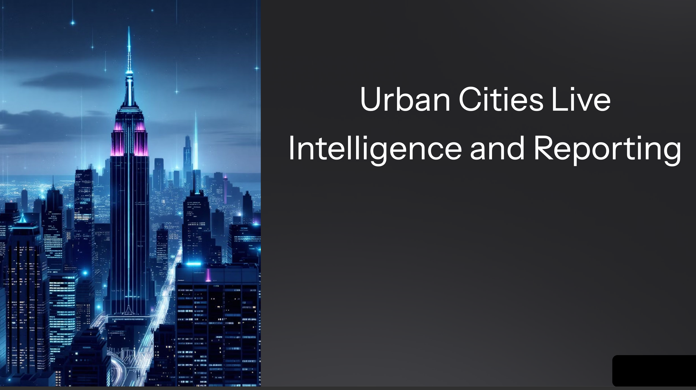

# NYC 311 Live Intelligence: Real-Time Urban Service Insights

A modern, incremental data pipeline that continuously ingests NYC 311 service requests, runs automated data-quality validation, and publishes clean, analytics-ready tables for operational and public-sector dashboards.





## Quickstart

```bash
# Create and activate virtual environment
python -m venv .venv && source .venv/bin/activate

# Install dependencies
pip install -r requirements.txt

# Copy env template and add your values
cp ingestion/.env.example ingestion/.env

# Test local ingestion
python -m ingestion.fetch_311_data
```

## Airflow
- export AIRFLOW_HOME=$(pwd)/airflow_home
- export AIRFLOW**CORE**LOAD_EXAMPLES=False
- airflow db init
- airflow webserver -p 8080 # terminal 1
- airflow scheduler # terminal 2

**DAG file**
- airflow_home/dags/nyc311_ingest_dag.py
  
**Fix import error by running**
  - pip install -e .

## Project Structure

- airflow_home/ # DAGs, logs, scheduler
- ingestion/ # API client + transforms
- sql/ # DDL, tests, views
- monitoring/ # alerts + runbook
- infrastructure/ # terraform (azure)
- dashboards/ # power bi placeholder
- docs/ # kpis, data dictionary, scope

**KPIs**

- Request volume (daily + rolling 7)
- SLA completion %
- Backlog size and aging
- Breakdown by borough / ZIP

**Notes**

- Use a Socrata app token to avoid API rate limits.
- Do not commit secrets — only .env.example.
- Power BI connects to the gold tables stored in Postgres.
